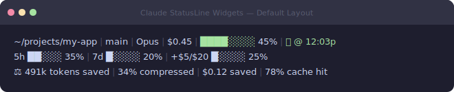
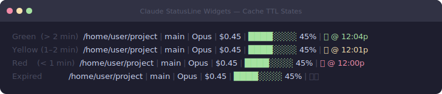
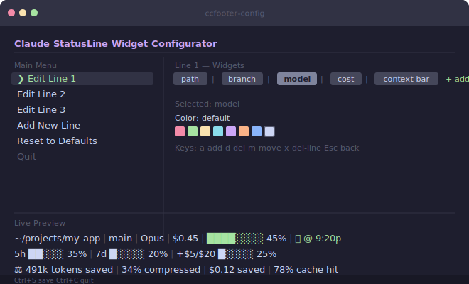
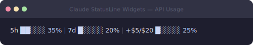

# Claude StatusLine Widgets

A configurable statusline plugin for [Claude Code](https://docs.anthropic.com/en/docs/claude-code) that displays real-time session metrics at the bottom of your terminal — model, cost, context window, cache TTL, API usage, and more. Comes with an interactive TUI for zero-friction visual configuration.


---

## What it looks like



The default layout renders three lines below your Claude Code prompt:

| Line | Content |
|------|---------|
| **1 — Session** | Working directory · git branch · model · cost · context bar · cache TTL |
| **2 — Usage** | 5-hour and 7-day rate-limit bars · overage spend *(hidden when unavailable)* |
| **3 — Headroom** | Tokens saved · compression % · cost saved · cache hit rate *(hidden unless proxy is active)* |

### Context window color coding

The context bar changes color as you approach the limit:


### Cache TTL color coding

The cache TTL indicator turns from green → yellow → red as expiry approaches:



---

## Installation

### From the Marketplace (recommended)

Inside a Claude Code session:

```
/plugin marketplace add JerrettDavis/ClaudeStatusLineWidgets
/plugin install cache-ttl-statusline@claude-statusline-widgets
```

Or from the CLI:

```bash
claude plugin marketplace add JerrettDavis/ClaudeStatusLineWidgets
claude plugin install cache-ttl-statusline@claude-statusline-widgets
```

Restart Claude Code — the statusline appears immediately at the bottom of your terminal.

### Standalone (without marketplace)

```bash
git clone https://github.com/JerrettDavis/ClaudeStatusLineWidgets.git
cd ClaudeStatusLineWidgets
npm install
```

Add to your Claude Code settings (`~/.claude/settings.json`):

```json
{
  "statusLine": {
    "type": "command",
    "command": "node /path/to/ClaudeStatusLineWidgets/dist/index.js"
  }
}
```

### Install the `ccfooter-config` CLI globally

```bash
# From a local clone
npm install -g .

# Directly from GitHub
npm install -g github:JerrettDavis/ClaudeStatusLineWidgets
```

---

## Configuration

### Interactive TUI

Launch the TUI configurator with:

```bash
ccfooter-config
```



The TUI lets you:

- **Add / remove / reorder** widgets on each line
- **Cycle display variants** for widgets that support multiple representations
- **Pick colors** from the full ANSI palette with a live preview
- Toggle a **global minimalist mode** for label-light output
- **Add or delete entire lines**
- **Reset** to the factory 3-line layout
- See a **live preview** that updates as you make changes

#### Keyboard shortcuts

| Context | Key | Action |
|---------|-----|--------|
| Global | `Ctrl+S` | Save settings |
| Global | `Ctrl+C` | Quit |
| Line Editor | `a` | Add a widget |
| Line Editor | `v` | Cycle the selected widget's display variant |
| Line Editor | `d` / `Delete` | Remove selected widget |
| Line Editor | `m` | Toggle move mode (reorder with arrow keys) |
| Line Editor | `x` | Delete entire line |
| Line Editor | `Esc` | Go back |
| Line Selector | `a` | Add a new line |
| Widget Picker | Arrow keys | Navigate widgets |
| Widget Picker | `Enter` | Select widget to add |
| Widget Picker | `Esc` | Cancel |

### Settings file

Settings are saved to `~/.config/claude-statusline-widgets/settings.json`. You can also edit this file directly. Example:

```json
{
  "version": 2,
  "minimalistMode": false,
  "lines": [
    [
      { "id": "1", "type": "model" },
      { "id": "2", "type": "separator" },
      { "id": "3", "type": "cost" },
      { "id": "4", "type": "separator" },
      { "id": "5", "type": "context-bar" },
      { "id": "6", "type": "separator" },
      { "id": "7", "type": "cache-ttl" }
    ],
    [
      { "id": "8", "type": "usage-5h" },
      { "id": "9", "type": "separator" },
      { "id": "10", "type": "usage-7d" }
    ]
  ]
}
```

Delete the settings file to reset to defaults.

For the full configuration reference (all options, environment variables, color names) see **[docs/configuration.md](docs/configuration.md)**.

---

## Available Widgets

Claude StatusLine Widgets now ships with **62 built-in widgets** across seven categories, plus **variants** for context, cache, usage, and skills widgets.

| Category | Included widgets |
|----------|------------------|
| Session | `path`, `branch`, `model`, `cost`, `session-id`, `version`, `output-style`, `session-clock`, `session-elapsed`, `account-email`, `thinking-effort`, `vim-mode`, `skills` |
| Context | `context-bar`, `context-percent`, `context-length`, `cache-ttl`, `cache-tokens` |
| Usage | `usage-5h`, `usage-7d`, `usage-overage`, `usage-reset-5h`, `usage-reset-7d` |
| Tokens | `tokens-input`, `tokens-output`, `tokens-total`, `input-speed`, `output-speed`, `total-speed` |
| Git | `git-status`, `git-changes`, `git-staged`, `git-unstaged`, `git-untracked`, `git-ahead-behind`, `git-conflicts`, `git-sha`, `git-root`, `git-insertions`, `git-deletions`, `git-origin-owner`, `git-origin-repo`, `git-origin-owner-repo`, `git-upstream-owner`, `git-upstream-repo`, `git-upstream-owner-repo`, `git-is-fork`, `git-worktree-mode`, `git-worktree-name`, `git-worktree-branch`, `git-worktree-original-branch` |
| Headroom | `headroom-tokens`, `headroom-compression`, `headroom-cost`, `headroom-cache-hit` |
| Environment | `terminal-width`, `memory-usage` |
| Layout | `separator`, `custom-text`, `custom-symbol`, `link`, `custom-command` |

Shared widget variants include:

- `context-bar`: `bar`, `percent`, `remaining`
- `context-percent`: `percent`, `bar`, `remaining`
- `cache-ttl`: `time`, `countdown`, `badge`
- `usage-5h` / `usage-7d`: `bar`, `percent`, `countdown`
- `usage-overage`: `bar`, `percent`
- `skills`: `count`, `list`

For per-widget documentation, examples, and configuration options see **[docs/widgets.md](docs/widgets.md)**.

---

## API Usage tracking



The usage line shows your real-time Anthropic rate-limit utilisation. Data is fetched in a background process every 60 seconds using your OAuth credentials from `~/.claude/.credentials.json` — no extra configuration needed if you are logged in to Claude Code.

---

## Headroom proxy integration


Set `ANTHROPIC_BASE_URL=http://127.0.0.1:8787` to activate the Headroom widgets.  They query the local proxy's `/stats` endpoint and display token savings, compression ratio, cost savings, and cache hit rate.

---

## How it works

Claude Code pipes a JSON payload to the statusline command via stdin on each render cycle. This plugin:

1. **Loads your settings** from `~/.config/claude-statusline-widgets/settings.json` (falls back to defaults)
2. **Parses the payload** for model, cost, context window, transcript path, and git info
3. **Renders each widget** in your configured layout via the widget registry
4. **Reads the session transcript** (JSONL) backwards to find the last cache write for TTL
5. **Fetches API usage data** in a detached background process (non-blocking, cached 60 s)
6. **Shows Headroom proxy stats** if `ANTHROPIC_BASE_URL` points to `localhost:8787`

When run interactively (stdin is a TTY), it launches the React/Ink TUI configurator instead.

---

## Architecture

```
.claude-plugin/
  marketplace.json  — Marketplace catalog
  plugin.json       — Plugin manifest

src/
  index.ts          — Entry point: TTY detection (TUI vs render mode)
  renderer.ts       — Settings-driven multi-line renderer
  cache.ts          — JSONL transcript parsing, TTL computation
  segments.ts       — Low-level formatters for each segment type
  colors.ts         — ANSI color/style helpers
  usage.ts          — Background API usage fetcher with file-based caching
  headroom.ts       — Headroom compression proxy stats integration

  widgets/
    types.ts        — Widget interface, WidgetItem config, RenderContext
    registry.ts     — Widget manifest and factory registry
    *.ts            — One file per widget implementation

  config/
    schema.ts       — Settings type, defaults, validation
    loader.ts       — Load/save settings, config path, migrations

  tui/
    index.tsx       — TUI entry point (runTUI)
    app.tsx         — Main app with screen router and preview
    components/     — MainMenu, LineSelector, ItemsEditor,
                       WidgetPicker, ColorMenu
```

---

## Development

```bash
npm install
npm run build        # Compile TypeScript
npm run dev          # Watch mode

# Test render mode with mock data
echo '{"model":{"display_name":"Opus"},"cost":{"total_cost_usd":0.12},"context_window":{"used_percentage":45},"git_branch":"main","cwd":"/home/user/project"}' | node dist/index.js

# Launch TUI configurator
ccfooter-config
# Or without global install:
node dist/index.js

# Regenerate docs screenshots
npm run build && node scripts/capture-screenshots.js
```

Screenshots in `docs/images/` are auto-regenerated by [the screenshots workflow](.github/workflows/screenshots.yml) whenever `src/` changes on `main`.

---

## License

MIT
